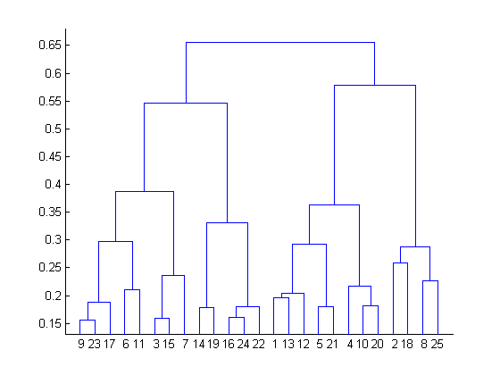

# 1. Clustering

Clustering 이란 주어진 데이터를 n개의 그룹으로 묶는 방법을 말한다. 이때의 그룹 안에 묶인 데이터는 최대한 비슷해야 한다. 클러스터링 알고리즘의 종류는 많지만, 여기서는 크게 두가지 알고리즘만 살펴볼 예정이다. 

- K-means Clustering
- Hierarchical Clustering

두 알고리즘은 클러스터링 분야에서 가장 많이 쓰는 보편적인 알고리즘이다. 이 둘을 잘 숙지하여 두자!

# 2. k-mean Clustering Algorithm

K-means clustering 방법은 굉장히 자주 쓰이는 알고리즘이다. 이 알고리즘의 특징은 다음과 같이 요약 할 수 있다.

1. Unsupervised Learning
2. k개의 군집 설정
3. 데이터 간의 Distance를 유클리디안 거리로 설정
4. Local Minimum 찾기, 근사 최적해

**k-means clustering의 목표 : **

$n$개의 d-차원 데이터 오브젝트 $(x_1, x_2, …, x_n)$ 집합이 주어졌을 때, k-평균 알고리즘은 $n$개의 데이터 오브젝트들을 각 집합 내 응집도(거리 합)를 최소로 하는 ${\displaystyle k(\leq n)}$ 개의집합 $S = S_1, S_2, …, S_k$으로 분할한다.

정리하면 각 집합별 중심점과 집합 내 데이터간 거리 제곱합을 최소로 하는 집합 $S$를 찾는 것이 이 알고리즘의 목표

**Algorithm은 다음 4단계를 통한다.**

> Step 1. k개의 중심점 선택 (**데이터 정규화, Outlier 제거 필수!**)
>
> Step 2. k개 중심점을 기준으로 각 데이터의 거리를 계산하고, 가장 가까운 중심점으로 데이터를 묶는다.
>
> Step 3. 각 묶인 데이터를 기준으로 새로운 k개 중심점을 계산한다.
>
> Step 4. 중심점이 바뀌지 않거나 다른 조건을 만족할 때까지 2~3 번을 반복한다.

# 3. k-means Clustering 예제 (by hand)

주어진 데이터가 다음과 같이 주어졌을 때 k=2인 k-means clustering을 구하라.

> | index |  x1  |  x2  |
> | ----- | :--: | :--: |
> | 1     |  1   |  1   |
> | 2     |  1   |  0   |
> | 3     |  0   |  2   |
> | 4     |  2   |  4   |
> | 5     |  3   |  5   |

> 1. 2개의 중심점을 임의의 데이터로 설정한다.
>    - c1 : (1, 1) 과 c2 : (0, 2)를 선택
> 2. 선택한 중심점과의 거리를 계산 후 가까운 중심점과 군집을 묶는다.
>
> | index | c1-dist | c2-dist | cluster |
> | ----- | ------- | ------- | :-----: |
> | 1     | 0       | 1.4     |   c1    |
> | 2     | 1       | 2.2     |   c1    |
> | 3     | 1.4     | 0       |   c2    |
> | 4     | 3.2     | 2.8     |   c2    |
> | 5     | 4.5     | 4.2     |   c2    |

> 3. 2개의 군집에서 새로운 중심점 2개를 계산한다.
>    - c1 : $(\frac{1+1}{2}, \frac{1+0}{2}) = (1, 0.5)$ 과 c2 : $(\frac{0+2+3}{3}, \frac{2+4+5}{3}) = (1.7, 3.7)$를 선택
> 4. 중심점을 기준으로 군집을 묶는다.
>
> | index | c1-dist | c2-dist | cluster |
> | ----- | ------- | ------- | :-----: |
> | 1     | 0.5     | 2.7     |   c1    |
> | 2     | 0.5     | 3.7     |   c1    |
> | 3     | 1.8     | 2.4     |   c1    |
> | 4     | 3.6     | 0.5     |   c2    |
> | 5     | 4.9     | 1.9     |   c2    |

> 4. 2개의 군집에서 새로운 중심점 2개를 계산한다.
>    - c1 : $(\frac{1+1+0}{3}, \frac{1+0+2}{3}) = (0.7, 1)$ 과 c2 : $(\frac{2+3}{2}, \frac{4+5}{2}) = (2.5, 4.5)$를 선택
> 5. 위와 같은 중심점에서 다시 군집으로 묶어도 4번과 같은 결과가 나오므로 여기서 종료한다.
>
> 최종결과 : 1, 2, 3번째 데이터는 C1군집에 속하게 되고, 4, 5번째 데이터는 C2 군집에 속하게 된다.

물론, 위에서는 간단한 예제를 들기 위해 단순한 데이터와 정규화 과정을 생략했지만 실제에서는 이를 간과해서는 안된다.

# 4. k-means clustering의 장단점

- 장점 
  1. 알고리즘이 쉽다.
  2. 계산이 빠르다. 
  3. $O(n)$의 계산 복잡성을 가진다.
- 단점
  1. Local Minimum으로 수렴
  2. 초기 중심점 선택에 따라 결과가 크게 좌우된다.
  3. Outlier에 민감하다.
  4. 원형의 클러스터로만 구성
  5. 데이터가 많고, feature가 크면 거리 계산시 많은 부하가 있을 수 있다.

# 5. Hierarchical Clustering

계층적 트리 모형을 이용해 개별 개체들을 순차적, 계층적으로 유사한 그룹과 통합하여 군집화를 수행하는 알고리즘이다. k-means clustering과는 다르게 군집의 수를 정하지 않아도 작업을 수행한다. 

핵심은 dendrogram을 생성 후 트리를 자르면 몇 개의 군집으로 분류할 수 있다.

# 6. Hierarchical Clustering Algorithm

1. 모든 데이터들간의 거리나 유사도를 계산
2. 밀집한 데이터끼리 묶는 작업을 하며 dendrogram 을 만든다.
3. 군집의 수를 정하여 dendrogram을 잘라 clustering 결과를 얻는다.

# 7. Hierarchical Clustering 예제 (by hand)

주어진 데이터는 다음과 같이 설정한다. 이를 이용하여 Hierarchical Clustering을 진행해보자!

> | index |  x1  |  x2  |
> | ----- | :--: | :--: |
> | 1     | 0.40 | 0.53 |
> | 2     | 0.22 | 0.38 |
> | 3     | 0.35 | 0.32 |
> | 4     | 0.26 | 0.19 |
> | 5     | 0.08 | 0.41 |
> | 6     | 0.45 | 0.30 |

1. 모든 데이터들의 거리를 계산하여 행렬로 표현하자. (거리 : 유클리디안 거리 사용)

   |      | 1    | 2    | 3    | 4    | 5    | 6    |
   | ---- | ---- | ---- | ---- | ---- | ---- | ---- |
   | 1    | 0    |      |      |      |      |      |
   | 2    | 0.23 | 0    |      |      |      |      |
   | 3    | 0.22 | 0.15 | 0    |      |      |      |
   | 4    | 0.37 | 0.20 | 0.15 | 0    |      |      |
   | 5    | 0.34 | 0.14 | 0.28 | 0.29 | 0    |      |
   | 6    | 0.23 | 0.25 | 0.11 | 0.22 | 0.39 | 0    |

2. dendrogram을 그린다.

   - (3, 6) 사이의 거리 값이 0.11로 가장 작은 거리로 계산된다. 첫번째 군집으로 결정하고 다음과 같이 dendrogram과 거리 행렬을 업데이트한다.

   - 첫번째 dendrogram

     

   - 거리 행렬 업데이트 과정

     - 다음과 같은 거리 계산 방법중 min distance를 선택

       

     - Update 결과

       |         | 1    | 2    | (3, 6) | 4    | 5    |
       | ------- | ---- | ---- | ------ | ---- | ---- |
       | 1       | 0    |      |        |      |      |
       | 2       | 0.23 | 0    |        |      |      |
       | (3,  6) | 0.22 | 0.15 | 0      |      |      |
       | 4       | 0.37 | 0.2  | 0.15   | 0    |      |
       | 5       | 0.34 | 0.14 | 0.28   | 0.29 | 0    |

       바뀌는 것이 없어보이지만, 그렇다 바뀐게 없다.. 그래도 예를 들어 보면 (3, 6)과 1 사이의 거리는 $min(dist(1, 3), dist(1, 6))$ 을 통하여 0.22라는 값을 계산한 것!

   - 두번째 dendrogram 그리기

     - (2, 5)를 선택하여 다음과 같이 그려진다.

     

     - 거리 행렬 업데이트

       |         | 1    | (2, 5) | (3, 6) | 4    |
       | ------- | ---- | ------ | ------ | ---- |
       | 1       | 0    |        |        |      |
       | (2,  5) | 0.23 | 0      |        |      |
       | (3,  6) | 0.22 | 0.15   | 0      |      |
       | 4       | 0.37 | 0.2    | 0.15   | 0    |

   - 세번째 dendrogram 그리기

     - (2, 5)와 (3, 6)을 선택하여 다음과 같이 그린다.

       

     - 거리 행렬 업데이트

       |                  | 1    | [(2, 5), (3, 6)] | 4    |
       | ---------------- | ---- | ---------------- | ---- |
       | 1                | 0    |                  |      |
       | [(2, 5), (3, 6)] | 0.22 | 0                |      |
       | 4                | 0.37 | 0.15             | 0    |

   - 네번째 dendrogram 그리기

     - [(2, 5), (3, 6)]과 4를 선택하여 다음과 같이 그리기

       

     - 거리 행렬 업데이트

       |                       | 1    | {[(2, 5), (3, 6)], 4} |
       | --------------------- | ---- | --------------------- |
       | 1                     | 0    |                       |
       | {[(2, 5), (3, 6)], 4} | 0.22 | 0                     |

   - 마지막 dendrogram 그리기

     - {[(2, 5), (3, 6)], 4}과 1을 선택하여 다음과 같이 그린다.

       

3. 우리가 원하는 만큼 군집의 수를 정하여 잘라 군집을 조정한다.

   - 군집 수 2 : [3, 6, 2, 5, 4], [1]
   - 군집 수 3 : [3, 6, 2, 5], [4], [1]

# 8. Hierarchical Clustering 장단점

- 장점
  - 사전에 군집수를 설정할 필요 없다.
- 단점
  - 계산 복잡성은 $O(n^3)$으로 k-means보다 무겁다.

# 9. 정리

- clustering algorithm에 대해 알아봤다.
- 그 중 k-means와 hierarchical를 알아봤으며 두 알고리즘 모두 쉬운 편에 속한다.
- 직접 손으로 해보면 금방 익숙해진다.

## Reference :

- [k-means clustering wiki](https://ko.wikipedia.org/wiki/K-%ED%8F%89%EA%B7%A0_%EC%95%8C%EA%B3%A0%EB%A6%AC%EC%A6%98)

- [k-means clustering example](https://www.youtube.com/watch?v=mtkWR8sx0NA)

- [An Introduction to Clustering and different methods of clustering](https://www.analyticsvidhya.com/blog/2016/11/an-introduction-to-clustering-and-different-methods-of-clustering/)

- [retsgo's blog](https://ratsgo.github.io/machine%20learning/2017/04/18/HC/)

- [hierarchical clustering by band](https://www.youtube.com/watch?v=RdT7bhm1M3E)

  ​