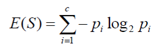
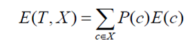
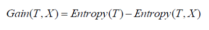
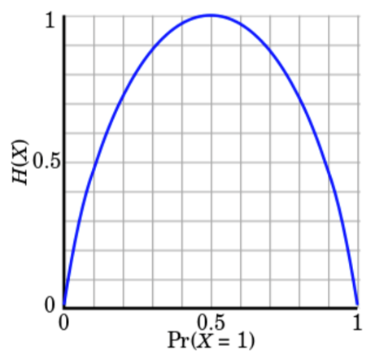

# 1. Decision Tree

- Supervised Learning 알고리즘 중 하나이다.
- 데이터 마이닝, 머신러닝에서 자주 사용하는 알고리즘이다.

# 2. Algorithm

>  가정
>
>  1. Train Data : ${(x_1, y_1), (x_2, y_2), (x_3, y_3), ..., (x_n, y_n)}$
>  2. $x_i$ : $k$개의 feature가 있는 $i$ 번째 데이터 샘플
>  3. $y_i$ : $i$ 번째 데이터 샘플의 클래스

**Step 1. 분기 전 Entropy, 분기 후 Entropy 계산**

**Step 2. 분기 후보들의 Information Gain 계산**

**Step 3. 가장 높은 Information Gain 의 분기 선택**

**Step 4. 위 과정을 종료 조건에 만족할 때까지 반복**

# 3. Entropy, Information Gain

- Entropy : 데이터가 균일하게 분류되어 있는지에 대한 척도

  - 분기 전의 Entropy 계산 공식

  

  - 분기 후의 Entropy 계산 공식

    

  - Entropy 大 : 클래스의 분포가 균등하다.

  - Entropy 小 : 클래스의 분포가 불균등하다. (한쪽으로 기울어져 분류된 상태)

- Information Gain : 분기 이전의 Entropy와 분기 이후의 Entropy의 차이

  

  - Information Gain 大 : 현재 선택한 분기에서 클래스의 분포가 불균형하다. 잘 분리되었다라고 판단.

- Entropy의 그래프는 다음과 같다.

  

  - 클래스의 분포가 균등하게 나와 각 클래스의 확률이 같다면 $-0.5log_20.5 -0.5log_20.5 = 1$ 로 최댓값을 계산할 수 있다.
  - 반대로 클래스의 분포가 하나의 클래스로만 분류되었다면 $-1log_21 -0log_20 = 0$, $\displaystyle\lim_{x\rightarrow0}xlogx = 0$ 로 최솟값을 계산할 수 있다.

# 4. Decision Tree의 장단점

- 장점
  1. 해석하기 쉽다. 즉, 해당 클래스로 예측했을 때 트리를 따라가며 예측 과정을 해석할 수 있다.
  2. 구현과 이해하기 쉬운 모델이다.
  3. 비모수적 모델이다. 즉, 통계모델에 요구되는 가정이 없음 (정규성, 독립성, 등분산성 등..)
- 단점
  1. 데이터의 수가 적을수록 모델이 불안정하다.
  2. Overfitting 발생 확률이 높다.

# 5. Decision Tree 예제

