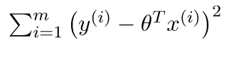
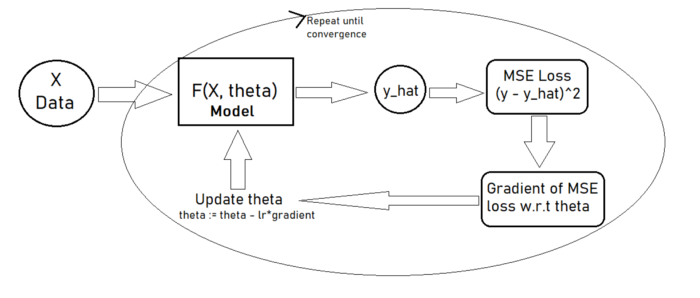

# 목록

1. 정의
2. 종류
   1. 모델들의 특징
   2. 모델들의 문제점
3. 구현
   1. 기본 데이터 사용
   2. sklearn 등 간단한 라이브러리를 이용
   3. 파이썬만을 사용해 비교
   4. 각 모델의 성능 비교
4. 응용
   1. kaggle 데이터를 통한 적용
5. 관련 문서

# 1. Regression이란?

Regression model은 하나 이상의 **독립 변수**와 **종속 변수** 사이의 관계를 함수로서 예측하는 모델이다.

- 독립 변수: Independent Variable, 입력 값이나 원인을 나타내는 변수를 의미한다. (feature)
- 종속 변수: Dependent Variable, 독립변수에 영향을 받는 변수를 의미한다. (target)

### Example

- 몸무게와 키의 관계를 선형 회귀 모델로 설명 가능

# 2. Regression의 종류

1. **Linear Regression**
2. **Ridge Regression**
3. **Neural Network Regression **
4. **Lasso Regression **
5. **Decision Tree Regression **
6. **Random Forest**
7. **KNN Model **
8. **Support Vector Machines (SVM)**
9. **Gausian Regression**
10. **Polynomial Regression**

- **Logistic Regression** 은 Classification model의 한 종류이다.

## 01. Linear Regression

Regression 모델 중 가장 널리 쓰이는 모델 중 하나이다. Linear Regression 모델은 2가지 방법을 통해 모델을 얻을 수 있다.

1. Gradient Descent
2. Normal Equation

Linear Regression의 목적: $y = \theta^t * x + b$ 를 데이터에 맞게 $\theta, b$ 를 구하는 것!

### Gradient Descent

Loss Function을 다음과 같이 정의한다.

그 후 Gradient Descent Algorithm을 이용하여 파라미터 $\theta$를 업데이트한다. (Loss Function을 최소화하도록)

1. 현재 파라미터에서의 $\hat{y}$을 계산
2. Loss를 계산
3. 파라미터 $\theta$에 대한 gradient를 계산한다.
4. 파라미터 $\theta$를 업데이트한다. ($\theta := \theta - \lambda*gradient$)
5. 1 ~ 4 단계를 반복

[구현](https://github.com/catssci/TIL/blob/main/Basic%20ML%20Algorithm/Linear%20Regression.ipynb)

### Normal Equation

# Reference

1. https://www.imsl.com/blog/what-is-regression-model
2. [10 Popular Regression Algorithms In Machine Learning Of 2022](https://www.jigsawacademy.com/popular-regression-algorithms-ml/#Support-Vector-Machines-(SVM))