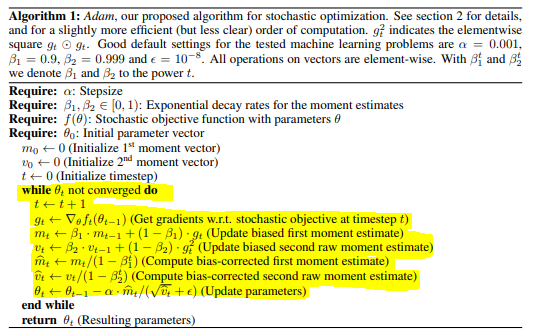

# Gradient Descent

- 일반적으로 풀이하면 **"1차 미분계수를 이용하여 함수의 최솟값을 찾아가는 최적화 알고리즘이다"** 라고 할 수 있다.
- 이를 딥러닝 학습에서 풀이한다면, **"Cost Function이 최솟값이 될 때의 파라미터를 찾는 Iterative Method 최적화 알고리즘이다"** 라고 할 수 있다.
- 대표적인 설명방법으로 **"눈을 감고 산을 내려가는데 가장 낮은 방향으로 한 걸음씩 움직이는 상황"** 비유되기도 한다.
- 결국 목표는 **cost function의 Global Minimum을 찾는 것이다.**
- 정리: **Cost Function에서의 Global Minimum에 해당하는 파라미터를 찾는 최적화 알고리즘이다. 이때 Gradient와 Learning Rate를 이용하여 최적화 방향과 보폭을 조정한다.**

# Algorithm

1. 현재 구현된 모델에서의 Cost Function을 확인한다.
2. Cost Function의 Gradient를 계산한다. (1차 미분계수 이용, Gradient는 현재 Cost Function에서의 기울기 정도를 의미. 즉, **값이 클수록 크게 기울어져 있다고 생각한다.**)
3. Learning rate만큼 곱하여 **Cost Function 값이 작아지는 방향**으로 움직인다. (움직인다는 것은 파라미터를 조정한다는 의미)
4. 위 2~3과정을 **종료조건**에 만족할 만큼 반복한다.

# 종료조건

- **반복 횟수**를 설정
- **Gradient가 일정 값** 이하로 계산되면 종료한다. (norm을 이용한다. 파라미터가 복수이면 Gradient는 벡터로 나온다.)

# 종류

1. Batch Gradient Descent
2. Stochastic Gradient Descent, mini-batch Gradient Descent (혼용하여 사용하기도 함)
3. Momentum (관성 추가)
4. Adagrad (보폭 조절)
5. RMSProp (보폭 조절)
6. Adam (관성 & 보폭 조절)

# Batch Gradient Descent

- **"모든 학습 데이터를 사용하여 Cost Function의 Global Minimum을 찾는 방법"** 라는 컨셉으로 한다.
- 장점 : 모든 데이터를 사용하기 때문에 SGD, Mini-Batch 보단 수렴성이 안정적이다.
- 단점 : 모든 데이터를 사용하기 때문에 훈련 데이터의 크기가 커지면 **계산 시간**이 오래 걸린다. 또한 **Learning rate에 따라 수렴 시간과 수렴 여부**가 크게 달라진다. **Local Minimum** 문제가 있다.
- 위와 같은 문제 때문에 **SGD, mini-batch** 같은 방법들이 나왔다.

# SGD, mini-batch

- SGD : **하나의 샘플**을 이용하여 업데이트하는 방법
- mini-batch : **batch size 만큼 데이터를 쪼개어** 업데이트하는 방법
- 두 방법은 샘플 데이터를 얼마나 사용하냐에 따라 다르지만, 보통 SGD로 혼용해서 사용하기도 한다.
- 장점 : 계산시간을 Batch 방법보다 절약할 수 있다.
- 단점 : **Shooting, 단편적인 데이터만을 이용**하여 수렴성이 변칙적이다. **batch size를 결정**해야 한다.
- 이와 같은 문제를 해결하기 위해 **Momentum, RMSProp** 와 같은 방법들이 나왔다.
- 보통 batch size는 2의 제곱으로 표현된다. (256, 512, 1024, ...)

# Momentum

- 이전 Gradient 정보까지 이용하여 파라미터를 업데이트한다.

- 즉, Momentum은 이전까지 계산한 gradient를 가져와 같이 업데이트한다.

- 식은 다음과 같이 사용한다.
  - $V_t = m * V_{t-1} + \lambda*\nabla_w J(w_t)$
  - $w_{t+1} = w_t - V_t$
  - $t = 1$
    - $V_1 = \lambda*\nabla_w J(w_1)$
    - $w_{2} = w_1- V_1 = w_1 -\lambda*\nabla_w J(w_1)$ , 처음에는 모멘텀 항 무시

  - $t = 2​$
    - $V_2 =m * V_{1} + \lambda*\nabla_w J(w_2)$
    - $w_{3} = w_2- V_2 = w_2 -(m * V_{1} + \lambda*\nabla_w J(w_2)) = w_2 -\lambda*\nabla_w J(w_2) - m*\lambda*\nabla_w J(w_1)$
  - $t = 3$
    - $V_3 =m * V_{2} + \lambda*\nabla_w J(w_3) = m^2*V_1 + m*\lambda*\nabla_w J(w_2) + \lambda*\nabla_w J(w_3) = m^2*\lambda*\nabla_w J(w_1) + m*\lambda*\nabla_w J(w_2) + \lambda*\nabla_w J(w_3)$
    - $w_{4} = w_3- V_3 = w_3 - \lambda*\nabla_w J(w_3) - m*\lambda*\nabla_w J(w_2) -m^2*\lambda*\nabla_w J(w_1)$
  - $t = n$
    - $V_n =m * V_{n-1} + \lambda*\nabla_w J(w_n) = \sum_{p=0}^{n-1}m^p*\lambda*\nabla_w J(w_{n-p})$
    - $w_{n+1} = w_n- V_n = w_n - \sum_{p=0}^{n-1}m^p*\lambda*\nabla_w J(w_{n-p})$
  - V는 이전까지의 그레디언트 정보를 계산하고, 이를 반영하여 파라미터를 업데이트한다. 가장 최근의 업데이트 항일수록 영향을 많이 준다.

# Adagrad

- 파라미터 업데이트 시에 보폭을 조절하는 항을 추가한 방법
- 지금까지 많이 변화하지 않은 변수들은 **보폭을 크게**, 많이 변화한 변수들은 **보폭을 작게** 조정한다.
- 식은 다음과 같이 사용한다.
  - $G(t) = G(t -1) + (\nabla_w J(w_t))^2 = \sum_{i = 0}^{t}(\nabla_w J(w_i))^2$
  - $w_{t+1} = w_t+\lambda*\frac{1}{\sqrt{G(t)+e}}*\nabla_w J(w_t)$
  - $t = n$
    - $w_{n+1} =  w_n+\lambda*\frac{1}{\sqrt{G(n)+e}}*\nabla_w J(w_n) = w_n+\lambda*\frac{1}{\sqrt{\sum_{i = 0}^{n}(\nabla_w J(w_i))^2+e}}*\nabla_w J(w_n)$
  - G는 현재까지의 그레이언트 값의 제곱합으로 표현되고, G를 Learning Rate에 나누어줌으로써 많이 변화된 변수는 Learning Rate를 작게, 적게 변화된 변수는 Learning Rate를 크게 조정한다.
- 위와 같은 방법을 적용했을 때 문제점으로 여겨지는 것이 time step이 커질 수록 **G값이 무한**적으로 커질 수 있다. 이에 대한 대안으로 RMSProp가 나왔다.

# RMSProp (Learning Rate Decay)

- 이전까지는 Learning rate가 고정되어 학습 속도와 보폭 조절이 어려운 문제점이 있었다. 그래서 학습할수록 Learning rate를 줄여 나가며 학습하는 방법을 제안하였다.**(Learning Rate Decay)** 일반적으로 초기에는 보폭을 넙게 그리고 후반에는 보폭을 좁게해야 Global Minimum에 수렴할 가능성이 높아진다.
- Adagrad 방법에서 G가 무한히 커지는 것을 방지하고자 G에 지수이동평균을 적용하여 과거일수록 gradient는 적게반영 후 learning rate를 조절한다.
- 식은 다음과 같이 사용한다.
  - $G_t = \gamma * G_{t-1} + (1 - \gamma) * (\nabla_wJ(w_t))^2$
  - $w_{t+1} = w_t - \lambda*\frac{1}{\sqrt {G_t+e}}*\nabla_wJ(w_t)$
  - $t = 1$
    - $G_1 = (1 - \gamma) * (\nabla_wJ(w_1))^2$
    - $w_{2} = w_1 - \lambda*\frac{1}{\sqrt {G_1+e}}*\nabla_wJ(w_1) = w_1 - \lambda*\frac{1}{\sqrt {(1 - \gamma) * (\nabla_wJ(w_1))^2+e}}*\nabla_wJ(w_1)$
  - $t = 2$
    - $G_2 = \gamma*G_1+(1 - \gamma) * (\nabla_wJ(w_2))^2 = \gamma*(1 - \gamma) * (\nabla_wJ(w_1))^2 + (1 - \gamma) * (\nabla_wJ(w_2))^2$
    - $w_{3} = w_2 - \lambda*\frac{1}{\sqrt {G_2+e}}*\nabla_wJ(w_2) = w_2 - \lambda*\frac{1}{\sqrt {\gamma*(1 - \gamma) * (\nabla_wJ(w_1))^2 + (1 - \gamma) * (\nabla_wJ(w_2))^2+e}}*\nabla_wJ(w_2)$
  - $t = 3$
    - $G_3 = \gamma*G_2+(1 - \gamma) * (\nabla_wJ(w_3))^2 = \gamma^2*(1 - \gamma) * (\nabla_wJ(w_1))^2 + \gamma*(1 - \gamma) * (\nabla_wJ(w_2))^2 + (1 - \gamma) * (\nabla_wJ(w_3))^2$
    - $w_{4} = w_3 - \lambda*\frac{1}{\sqrt {G_3+e}}*\nabla_wJ(w_3) = w_3 - \lambda*\frac{1}{\sqrt {\gamma^2*(1 - \gamma) * (\nabla_wJ(w_1))^2 + \gamma*(1 - \gamma) * (\nabla_wJ(w_2))^2 + (1 - \gamma) * (\nabla_wJ(w_3))^2+e}}*\nabla_wJ(w_3)$
  - $t = n$
    - $G_n = \gamma*G_{n-1}+(1 - \gamma) * (\nabla_wJ(w_n))^2 = \sum_{i=0}^{n-1}\gamma^i*(1-\gamma)*(\nabla_wJ(w_{n-i}))^2$
    - $ w_{n+1} = w_n - \lambda*\frac{1}{\sqrt {G_n+e}}*\nabla_wJ(w_n) = w_n - \lambda*\frac{1}{\sqrt { \sum_{i=0}^{n-1}\gamma^i*(1-\gamma)*(\nabla_wJ(w_{n-i}))^2+e}}*\nabla_wJ(w_n)$
  - G는 **지수이동평균**으로 최신 기울기를 더 반영하여 Learning rate를 줄여준다.

# Adam (Adaptive Moment Estimation)

- Momentum과 Learning Rate Decay 방법을 합친 방법이다.

- 수식은 다음과 같다.
  - $M_t = \beta_1*M_{t-1} + (1-\beta_1)*\nabla_wJ(w_t)$
  - $V_t = \beta_2*V_{t-1} + (1-\beta_2)*(\nabla_wJ(w_t))^2$
  - $\hat{M_t}=\frac{M_t}{1-\beta_1^t}$
  - $\hat{V_t}=\frac{V_t}{1-\beta_2^t}$
  - $W_{t+1} = W_t - \lambda*\frac{\hat{M_t}}{\sqrt{\hat{V_t}+e}}$
  - Momentum 항과 Learning Rate Decay 항에 지수이동평균을 사용하여 가장 최근의 업데이트 정보를 우선적으로 반영한다. 또한 이를 그대로 사용하는 것이 아닌 $1-\beta^t$를 나눔으로써 바이어스 보정을 한 후에 파라미터를 업데이트한다.
    * **지수이동평균에서 0으로 시작하는 경우 바이어스 보정을 해야 한다는 데 잘 모르겠다. 이는 추후에 업데이트 예정!**

# BackPropagation

- 단순히 neural network에서 gradient descent를 chain rule을 사용하여 단순화 시킨 것

# Cost Function의 종류

- 다음과 같이 나눌 수 있고, 각각의 장단점은 이렇게 존재한다.
- 표로 정리하면 더 좋고
- Regression
  - ME (Mean Error)
    - 수식: $\frac{1}{n}\sum_{i=0}^{n}(y-\hat{y})$
    - 단점: error값의 범위가 음수, 양수 가리지 않고 모두 더하므로 실제 오차보다 작게 나올 수 있다.
  - MAE (Mean Absolute Error)
    - 수식: $\frac{1}{n}\sum_{i=0}^{n}|y-\hat{y}|$
    - 장점: MSE 보다 이상치의 영향을 적게 받는다.
    - 단점: 미분 불가능한 지점이 존재한다.
  - **MSE (Mean Squared Error)**
    - 수식: $\frac{1}{n}\sum_{i=0}^{n}(y-\hat{y})^2$
    - 장점: 모든 구간에서 미분 가능하다.
    - 단점: MAE 보다 이상치의 영향을 받는다.
  - RMSE (Root Mean Squared Error)
    - 수식: $\sqrt{\frac{1}{n}\sum_{i=0}^{n}(y-\hat{y})^2}$
    - 장점: MSE보다 이상치의 영향을 덜 받는다.
    - 단점: 미분 불가?, MAE와 MSE의 중간 포지션
  - MSLE (Mean Squared Log Error)
  - MAD (Median Absolute Deviation)

- Classification
  - **Cross Entropy**
    - 수식: $-\sum_{i=0}^{C}y_i*log(\hat{y})$

# Reference

- [An overview of gradient descent optimization algorithms](https://ruder.io/optimizing-gradient-descent/)
- [수식과 코드로 보는 경사하강법](https://twinw.tistory.com/247)

# 추가적으로 공부 할 것

- 이동 평균 (RMSProp, Adam)
  - 단순 이동 평균
  - 지수 이동 평균
  - 바이어스 보정 이유