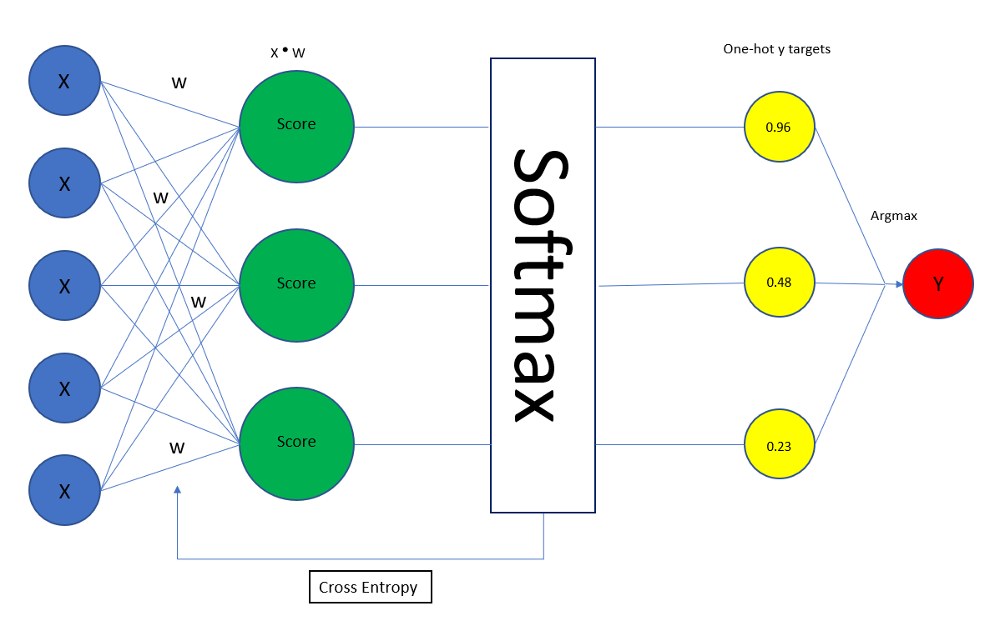

# Sigmoid

- 활성화 함수 중 하나로 0과 1 사이의 실수를 출력하는 비선형 함수이다.

- 수식은 다음과 같이 사용한다.
  - $\frac{1}{1+e^{-f(x)}}$

- 관련있는 모델: `Logistic Regression` `LSTM` `GRU`

  

# 단점

- gradinet의 0지점에서 0.25이로 최댓값을 가지고 , 이외에서는 gradient가 계속 작아진다. (아래의 미분 결과 참조)
- 그래서 모델 학습 시 **Gradient Vanishing** 문제가 발생 할 수 있다.

# 미분 결과

- 모델 학습시에 활성화 함수의 미분값을 사용해야 한다.
- Sigmoid는 다음과 같이 미분을 할 수 있다.
  - $\frac{d}{dx}sigmoid(x) = sigmoid(x)*(1 - sigmoid(x))$

- 미분 결과 최대값이 0.25이다. 즉, 모델이 깊어질수록 Sigmoid를 계속사용한다면 Gradient가 지속적으로 작아질 것이다. (**Gradient Vanishing**)

# Binary Logistic Regression

- Binary Classification 문제에서는 **Sigmoid를 사용하여 해당 출력**이 클래스의 확률을 대표한다 할 수 있다.
- 즉, Sigmoid의 결과는 하나의 클래스에 주목하여 클래스의 확률을 계산한다. 다른 클래스와의 관계를 표현하지 않는다.

# Mutinomial Logistic Regression

- Multi Class Classification 문제에서는 **Softmax를 사용하여 클래스의 확률**을 벡터로 표현한다.

  

- $probability = \sigma(\sum_{i=0}^{k}x_ik_i+b)$

- 선형 뉴럴 네트워크에 출력 네트워크의 activation function으로 sigmoid를 사용한 네트워크 모델이다.

- 위는 binary classification에서의 Logistic Regression이고, 아래는 Multi classification에서의 Logistic Regression 모델이다.

- Binary Model과는 다르게 softmax 함수를 이용하여 최종 출력을 계산한다.

- logit: 일반적으로 [$-\infin , +\infin$] 범위에 해당하는 네트워크 출력, 다르게 하면 sigmoid의 역변환을 의미한다.

  

- Pytorch의 [CrossEntropyLoss](https://pytorch.org/docs/stable/generated/torch.nn.CrossEntropyLoss.html)를 사용할 때는 최종 레이어에 Softmax를 쓰면 안된다. 즉, Logit이어야한다. 왜냐하면 [CrossEntropyLoss](https://pytorch.org/docs/stable/generated/torch.nn.CrossEntropyLoss.html)가 내부적으로 LogSoftmax 후 NLLLoss를 하기 때문이다. Binary Classification도 마찬가지이다.

# Reference

- https://machinelearningmastery.com/a-gentle-introduction-to-sigmoid-function/
- https://dataaspirant.com/multinomial-logistic-regression-model-works-machine-learning/
- https://jins-sw.tistory.com/38
- https://opentutorials.org/module/3653/22995
- [Multinomial Logistic Regression In a Nutshell](https://medium.com/ds3ucsd/multinomial-logistic-regression-in-a-nutshell-53c94b30448f)

