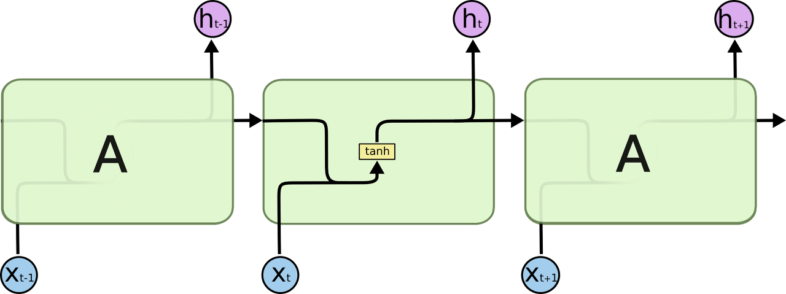
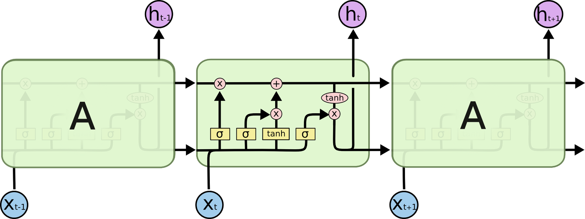
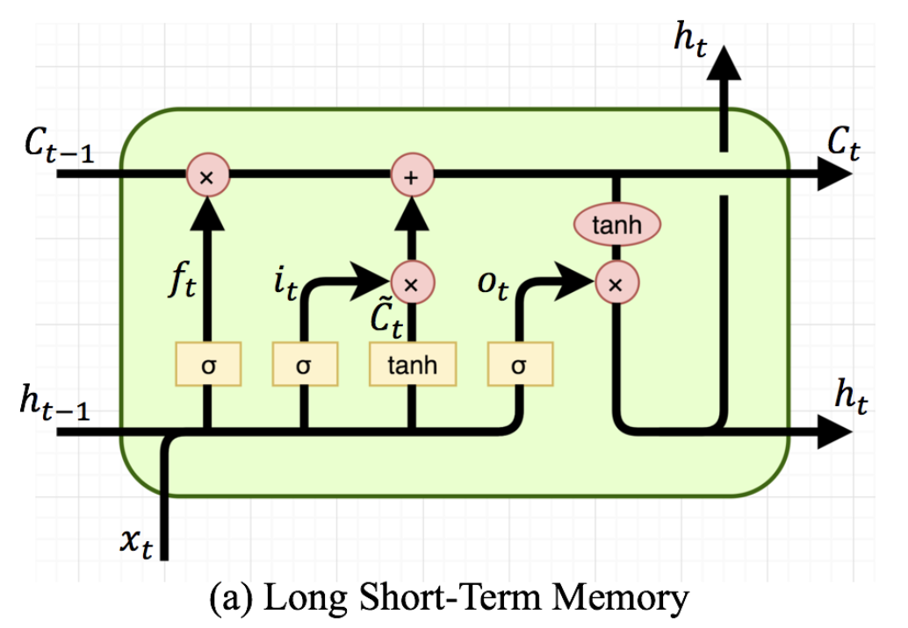
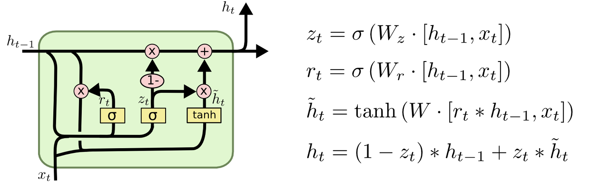

# Sigmoid

- 활성화 함수 중 하나로 0과 1 사이의 실수를 출력하는 비선형 함수이다.

- 수식은 다음과 같이 사용한다.
  - $\frac{1}{1+e^{-f(x)}}$

- 관련있는 모델: `Logistic Regression` `LSTM` `GRU`

  

# 단점

- gradinet의 0지점에서 0.25이로 최댓값을 가지고 , 이외에서는 gradient가 계속 작아진다. (아래의 미분 결과 참조)
- 그래서 모델 학습 시 **Gradient Vanishing** 문제가 발생 할 수 있다.

# 미분 결과

- 모델 학습시에 활성화 함수의 미분값을 사용해야 한다.
- Sigmoid는 다음과 같이 미분을 할 수 있다.
  - $\frac{d}{dx}sigmoid(x) = sigmoid(x)*(1 - sigmoid(x))$

- 미분 결과 최대값이 0.25이다. 즉, 모델이 깊어질수록 Sigmoid를 계속사용한다면 Gradient가 지속적으로 작아질 것이다. (**Gradient Vanishing**)

# Binary Logistic Regression

- Binary Classification 문제에서는 **Sigmoid를 사용하여 해당 출력**이 클래스의 확률을 대표한다 할 수 있다.
- 즉, Sigmoid의 결과는 하나의 클래스에 주목하여 클래스의 확률을 계산한다. 다른 클래스와의 관계를 표현하지 않는다.

# Mutinomial Logistic Regression

- Multi Class Classification 문제에서는 **Softmax를 사용하여 클래스의 확률**을 벡터로 표현한다.

  

- $probability = \sigma(\sum_{i=0}^{k}x_ik_i+b)$

- 선형 뉴럴 네트워크에 출력 네트워크의 activation function으로 sigmoid를 사용한 네트워크 모델이다.

- 위는 binary classification에서의 Logistic Regression이고, 아래는 Multi classification에서의 Logistic Regression 모델이다.

- Binary Model과는 다르게 softmax 함수를 이용하여 최종 출력을 계산한다.

- logit: 일반적으로 [$-\infty , +\infty$] 범위에 해당하는 네트워크 출력, 다르게 하면 sigmoid의 역변환을 의미한다.

  

- **Pytorch의 [CrossEntropyLoss](https://pytorch.org/docs/stable/generated/torch.nn.CrossEntropyLoss.html)를 사용할 때는 최종 레이어에 Softmax를 쓰면 안된다. 즉, Logit이어야한다. 왜냐하면 [CrossEntropyLoss](https://pytorch.org/docs/stable/generated/torch.nn.CrossEntropyLoss.html)가 내부적으로 LogSoftmax 후 NLLLoss를 하기 때문이다.** Binary Classification도 마찬가지이다.

# LSTM 모델에서의 sigmoid 활용

- 기존 RNN 모델의 문제점: 장기 의존성 문제 발생 (`the problem of Long-Term Dependencies`) $\sim$ `Vanising Gradient Problem`
- 위의 문제를 해결하기 위해 LSTM이 제안됨

- RNN vs LSTM 모델

  |                   RNN                    |                   LSTM                   |
  | :--------------------------------------: | :--------------------------------------: |
  |  |  |

- LSTM 구조
  - 4개의 모듈과 2개의 output으로 구분된다.
  - 4개 모듈은 3개의 Gate로 표현된다. (forget, input, output gate)

- 학습 과정
  - Forget Gate: 정보를 얼마나 잊을지에 대한 gate
    - $f_t = \sigma(W_f*[h_{t-1}, x_t] + b_f) \rightarrow $ 0~1 사이의 값이 나오고, 이는 이전 레이어에서 정보의 보전 정도를 나타낸다.
    - $W_f*[h_{t-1}, x_t] = W_{ff}*h_{t-1} + W_{xf}*x_t$  ??
  - Input Gate: 현재 상태의 input을 얼마나 기억할지에 대한 gate
    - $i_t = \sigma(W_i*[h_{t-1}, x_t] + b_i)$
    - $\tilde{C_t} = tanh(W_C*[h_{t-1}, x_t] + b_C)$ 
  - State Update: RNN 문제를 해결하기 위한 키!
    - $C_t = f_t*C_{t-1}+i_t*\tilde{C_t}$
    - 이전 단계에서 잊는 정도를 계산하고, 현재 상태에서 반영 정도를 계산한다.
    - forget gate와 input gate가 0이라면 이전 상태를 그대로 반영하고, 1이라면 현재 상태를 그대로 반영한다.
  - Output Gate: 다음 상태로 보낼 output
    - $o_t = \sigma(W_o*[h_{t-1}, x_t] + b_o)$
    - $h_t = o_t*tanh(C_t)$
    - output gate를 통해서 다음 상태로 보낼 정도를 조정한다.

- LSTM에서의 sigmoid 활용은 다음과 같이 정리 할 수 있다.
  - 0~1 사이의 값을 출력하기 위한 activation function
  - 의미로 보면 각 게이트에 출력으로 사용되며, 정보를 얼마나 보낼지에 대한 통제 수단으로 사용된다.

# GRU에서의 sigmoid 활용

- LSTM을 간소화한 모델이다.

- LSTM과의 차이점
  - Gate 개수 변화: 3개 $\rightarrow$ **2개**
  - Cell state와 Hidden state를 통합하여 하나의 Hidden state로 표현
  - forget gate와 input gate를 통합하여 update gate로 통제
  - output gate를 없앰
- 2개의 Gate
  - Reset Gate: 이전 hidden state의 정보를 얼마나 반영할지 통제
  - Update Gate: 이전 상태와 현재 상태를 얼마나 반영할지 통제
- GRU에서의 sigmoid 활용은 LSTM과 같은 방식으로 활용되는 것을 알 수 있다.

# Reference

- https://machinelearningmastery.com/a-gentle-introduction-to-sigmoid-function/
- https://dataaspirant.com/multinomial-logistic-regression-model-works-machine-learning/
- https://jins-sw.tistory.com/38
- https://opentutorials.org/module/3653/22995
- [Multinomial Logistic Regression In a Nutshell](https://medium.com/ds3ucsd/multinomial-logistic-regression-in-a-nutshell-53c94b30448f)

- [호다닥 공부해보는 RNN 친구들(2) - LSTM & GRU](https://gruuuuu.github.io/machine-learning/lstm-doc2/)

# 추가로 공부해야 할 것

- RNN 계열의 모델들을 좀 더 깊게 공부
  - RNN
  - LSTM
  - GRU
  - RNN 계열 모델을 통한 문제 해결 과정