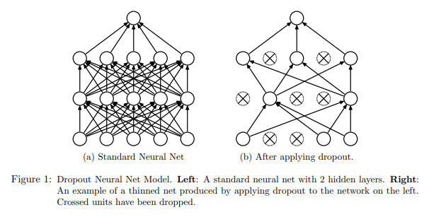

# Dropout

- 히든레이어의 일부 뉴런의 동작을 멈춰가며 모델을 학습 방법이다.



# 사용 이유

- Overfitting 문제를 막기 위해서 사용한다.
- Regularization 효과를 줄 수 있다. (~ L1, L2 Regularization)
- 여러개의 모델을 학습하여 앙상블하는 효과를 줄 수 있다.

# Overfitting

- training 에러는 줄어들지만, validation 에러는 증가하는 순간을 말한다.

  

# Regularization

- 각 레이어에서 일정한 확률 p를 부여한다. 그 후 각 노드에서 p의 확률로 노드를 삭제하며 훈련을 진행한다. (Dropout)

- 따라서 훈련 시 원래 네트워크보다 감소된 네트워크를 통해 훈련된다.

- 각 데이터 샘플에서 감소된 네트워크를 통해 훈련되므로 정규화 효과를 얻을 수 있게된다.

  

  - 왼쪽에서 보라색 노드의 결과를 살펴보면, dropout을 적용한 경우 이전 레이어 노드들의 영향을 특정 지을 수 없다.
  - 그래서 어느 한쪽 노드의 가중치 값을 크게 할 수 없으며, 이전 노드들의 가중치를 분산시키는 전략을 세우게 된다.
  - L2 정규화와 비슷한 효과를 줄 수 있다.

# 앙상블

- 각 데이터 샘플마다 감소된 네트워크는 일정하지 않으므로 여러 네트워크를 학습한 효과를 얻을 수 있다.
- 그래서 앙상블과 같은 효과를 얻는다.

# 테스트 할때

- Dropout을 끄고 테스트를 진행한다.
- 결과가 무작위적으로 나오는 것을 원하지 않기 때문이다.
- 이론적으로 dropout을 킨 후 무작위적으로 나오는 예측 값의 평균을 낼 수도 있음
  - inverted dropout을 사용
  - 스케일링 변수를 추가 하지 않아도 됨.


# Inverted dropout

```python
# num layer: 3
keep_prob = 0.8 					# 유닛이 유지될 확률
d3 = np.random.rand(a3.shape[0], a3.shape[1]) < keep_prob
a3 = np.multiply(a3, d3)			# a3 *= d3
a3 /= keep_prob						# Inverted dropout

"""
	ex)
	50 units가 있다고 한다면, keep_prob = 0.8 일때 -> 10 units shut off 한다.
	즉, z4 = w4 * a3 + b4 가 되고,
	a3는 dropout을 사용하지 않았을 때보다 20% 정도 감소된 상태이다. (reduced by 20%)
	a3의 기댓값을 유지시켜주기 위해 keep_prob을 나누어 준다.
"""

```


# Reference

- https://www.youtube.com/watch?v=D8PJAL-MZv8
- https://www.youtube.com/watch?v=ARq74QuavAo


# 추가

- 해당 내용을 다루는 유튜브를 다시 정독하고 정리한다.